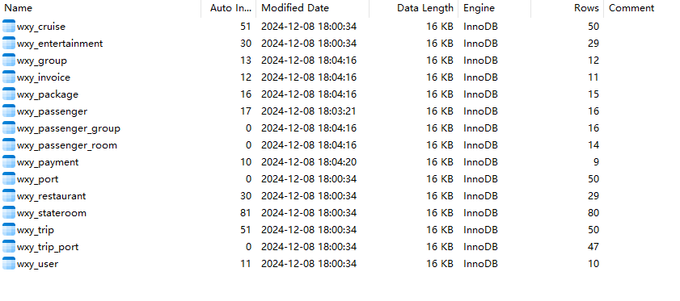
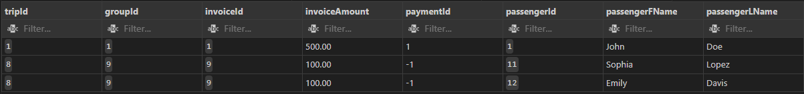
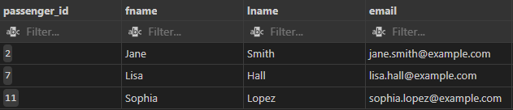
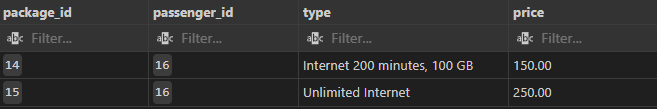
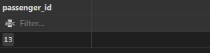
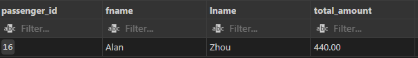
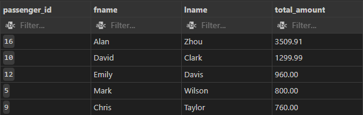

<h1><center>Principles of Database System</center></h1>

<h1><center>CS-GY 6083B, Fall 2024</center></h1>

<h2><center>Final Project</center></h2>

<h2><center>Submission Date: Dec 8</center></h2>


[TOC]

## Group Information

- `Yuheng Wu` NetID: `yw5372` NYUID: `N17059532`
- `Xingyu Han` NetID: `xh2787` NYUID: `N19933026`
- `Weizhen Zhou` NetID: `wz3008` NYUID: `N17357458`


## [Our Github Repository Link](https://github.com/Apricothxy/DatabaseProject)


1. ​	Execute Summary
2. ​	Software, programming language and database used
3. ​	DDL Code (MySql)
4. ​	Database Summary
5. ​	Web Application Interface Preview
6. ​	Security Features
7. ​	Reflections
8. ​	Business analysis

## Execute Summary

  ​	When the user tries to book tickets, the user needs to select 'Departure Location', 'Arrival Location', "Departure Date', and 'Arrival Date'. The filter will show all the trip that fits the requirements. 

  ​	When users select the trip they want to book tickets for, the web application will first show them all the details about this trip. Includes Cruise Details like cruise name, itinerary, and intermediate stops, as well as entertainment, restaurants, and staterooms this trip could provide. 

  ​	If the user wants to book tickets for this trip, the user needs to select passengers who will be included in this trip. The user can also include some other passengers later by booking again for this trip. For each passenger, the user needs to select the stateroom, packages, and night number for each package (here we set the constraint that only a 5+-year-old passenger can have the package and only a 21+-year-old passenger can order the package "unlimited Bar").

  ​	Afterward, users can choose to pay immediately or later in the section "My Orders" where they can view all their booking information and payment status.

  ​	To manage the information of the cruise company, we set the 'Administrator Login', where the administrator can manage the trip, cruise, and user.

- Logical Model


- Relational Model

  

## Software, programming language and database used

**Software: IntelliJ IDEA, VScode, Oracle, Postman, JDK 22, Maven**

**Programming Language: Java, HTML, CSS, JavaScript,  MySql, SQL**

**Database: MySql**

  

## DDL Code (MySql)

  ```MySql
  use databaseproject;
  
  CREATE TABLE IF NOT EXISTs wxy_passenger_group (
      group_id     INT NOT NULL,
      passenger_id INT NOT NULL
  );
  
  ALTER TABLE wxy_passenger_group ADD CONSTRAINT wxy_passenger_group_pk PRIMARY KEY ( group_id, passenger_id );
  
  CREATE TABLE wxy_cruise (
      cruise_id   INT AUTO_INCREMENT NOT NULL COMMENT 'cruise id',
      trip_id     INT,
      cruise_name VARCHAR(100) NOT NULL,
      PRIMARY KEY (cruise_id)
  );
  
  CREATE UNIQUE INDEX wxy_cruise__idx ON wxy_cruise (trip_id ASC);
  
  CREATE TABLE wxy_entertainment (
      entertainment_id INT AUTO_INCREMENT NOT NULL COMMENT 'entertainment id',
      type             VARCHAR(20) NOT NULL COMMENT 'entertainment type',
      units_num        INTEGER NOT NULL COMMENT 'units number',
      floor_1          INTEGER NOT NULL COMMENT 'on which floor',
      floor_2          INTEGER COMMENT 'on which floor',
      floor_3          INTEGER COMMENT 'on which floor',
      age_limits       INT NOT NULL COMMENT 'age limits for passengers',
      cruise_id        INT NOT NULL COMMENT 'on which cruise',
      PRIMARY KEY (entertainment_id)
  );
  
  ALTER TABLE wxy_entertainment
      ADD CHECK ( type IN ( 'casino', 'children play', 'gym', 'indoor pool', 'library',
                            'night club', 'outdoor pool', 'sona room', 'steam room', 'tennis court',
                            'theaters', 'whirlpool', 'yoga room' ) );
  
  
  CREATE TABLE wxy_group (
      group_id INT AUTO_INCREMENT PRIMARY KEY,
      trip_id  INT NOT NULL COMMENT 'trip group belong to'
  );
  
  -- ALTER TABLE wxy_group ADD CONSTRAINT wxy_group_pk PRIMARY KEY ( group_id );
  
  CREATE TABLE wxy_invoice (
      invoice_id   INT AUTO_INCREMENT PRIMARY KEY,
      amount       DECIMAL(10, 2) NOT NULL COMMENT 'amount in us dollar',
      invoice_date DATETIME NOT NULL COMMENT 'date of the invoice',
      group_id     INT NOT NULL
  );
  
  CREATE UNIQUE INDEX wxy_invoice__idx ON wxy_invoice (group_id ASC );
  
  -- ALTER TABLE wxy_invoice ADD CONSTRAINT wxy_invoice_pk PRIMARY KEY ( invoice_id );
  
  CREATE TABLE wxy_package (
      package_id   INT AUTO_INCREMENT PRIMARY KEY,
      type         VARCHAR(50) NOT NULL,
      price        DECIMAL(10, 2) NOT NULL,
      passenger_id INT
  );
  
  ALTER TABLE wxy_package ADD CHECK ( price >= 0 );
  
  -- ALTER TABLE wxy_package ADD CONSTRAINT wxy_package_pk PRIMARY KEY ( package_id );
  
  ALTER TABLE wxy_package
      ADD CHECK ( type IN ( 'Water and Non-Alcoholic', 'Unlimited Bar', 'Internet 200 minutes, 100 GB', 
                             'Unlimited Internet', 'Specialty dining' ) );
  
  CREATE TABLE wxy_passenger (
      passenger_id     INT AUTO_INCREMENT NOT NULL COMMENT 'passenger id',
      fname            VARCHAR(50) NOT NULL COMMENT 'first name',
      mname            VARCHAR(50) COMMENT 'middle name',
      lname            VARCHAR(50) NOT NULL COMMENT 'last name',
      birth_date       DATETIME NOT NULL COMMENT 'age',
      address_country  VARCHAR(50) NOT NULL COMMENT 'address country',
      address_state    VARCHAR(50) NOT NULL COMMENT 'address state',
      address_city     VARCHAR(50) NOT NULL COMMENT 'address city',
      address_street_1 VARCHAR(50) NOT NULL COMMENT 'address street 1',
      address_street_2 VARCHAR(50) COMMENT 'address street 2 optional',
      gender           VARCHAR(50) NOT NULL COMMENT 'gender, feel free to identify',
      nationality      VARCHAR(50) NOT NULL COMMENT 'nationality',
      email            VARCHAR(50) NOT NULL COMMENT 'email address',
      phone            VARCHAR(50) NOT NULL COMMENT 'phone number',
      -- group_id         INT NOT NULL,
      user_id          INT,
      PRIMARY KEY (passenger_id)
  );
  
  # ALTER TABLE wxy_passenger ADD CONSTRAINT wxy_passenger_pk PRIMARY KEY ( passenger_id );
  
  CREATE TABLE wxy_passenger_room (
      price        DECIMAL(10, 2) NOT NULL COMMENT 'price of this room for this passenger',
      room_id      INT NOT NULL,
      passenger_id INT NOT NULL
  );
  
  ALTER TABLE wxy_passenger_room ADD CHECK ( price >= 0 );
  
  ALTER TABLE wxy_passenger_room ADD CONSTRAINT wxy_passenger_room_pk PRIMARY KEY ( room_id, passenger_id );
  
  CREATE TABLE wxy_payment (
      payment_id INT AUTO_INCREMENT PRIMARY KEY,
      amount     DECIMAL(10, 2) NOT NULL COMMENT 'amount in us dollar',
      `DATE`     DATETIME NOT NULL COMMENT 'payment data',
      method     VARCHAR(50) NOT NULL COMMENT 'payment method',
      invoice_id INT NOT NULL COMMENT 'invoice the payment for'
  );
  
  -- ALTER TABLE wxy_payment ADD CONSTRAINT wxy_payment_pk PRIMARY KEY ( payment_id );
  
  CREATE TABLE wxy_port (
      port_id                 INT NOT NULL COMMENT 'port id',
      port_name               VARCHAR(50) NOT NULL COMMENT 'port name',
      state                   VARCHAR(50) NOT NULL COMMENT 'state address',
      country                 VARCHAR(50) NOT NULL COMMENT 'country address',
      address1                VARCHAR(50) NOT NULL COMMENT 'address1',
      address2                VARCHAR(50) COMMENT 'address2, optional',
      nearest_airport_name    VARCHAR(50) NOT NULL COMMENT 'nearest airport name',
      number_of_parking_spots INT NOT NULL COMMENT 'number of parking spots'
  );
  
  ALTER TABLE wxy_port ADD CONSTRAINT wxy_port_pk PRIMARY KEY ( port_id );
  
  CREATE TABLE wxy_restaurant (
      restaurant_id INT AUTO_INCREMENT NOT NULL COMMENT 'resturant id',
      type          VARCHAR(20) NOT NULL COMMENT 'resurant type',
      start_time    DATETIME NOT NULL COMMENT 'resturant service start time',
      end_time      DATETIME NOT NULL COMMENT 'resturant service end time',
      floor         INTEGER NOT NULL COMMENT 'resturant on which floor',
      cruise_id     INT NOT NULL COMMENT 'returant belong to which cruise',
      PRIMARY KEY (restaurant_id)
  );
  
  ALTER TABLE wxy_restaurant
      ADD CHECK ( type IN ( 'Common Buffett', 'Italian Specialty', 'La carte continental', 'Mexican Specialty', 'Ming Work Chinese',
                            'Pool Bar', 'Round Clock Cafe', 'Stout Bar', 'Tokyo Ramen Japanese' ) );
  
  
  
  CREATE TABLE wxy_stateroom (
      room_id          INT AUTO_INCREMENT NOT NULL COMMENT 'stateroom id',
      type             VARCHAR(20) NOT NULL COMMENT 'room type',
      `SIZE`           INT NOT NULL COMMENT 'room size',
      bed_num          INT NOT NULL COMMENT 'bed number',
      bathroom_num     INT NOT NULL COMMENT 'bathroom number',
      balcony          INT NOT NULL COMMENT 'balcony number',
      cruise_id        INT NOT NULL COMMENT 'room belong to which cruise',
      price_per_person DECIMAL(10, 2) NOT NULL COMMENT 'price of the stateroom',
      position         VARCHAR(20) NOT NULL,
      PRIMARY KEY (room_id)
  );
  
  ALTER TABLE wxy_stateroom
      ADD CHECK ( type IN ( 'club balcony suite', 'family balcony', 'family large balcony', 'inside stateroom', 'oceanview window',
                            'studio stateroom', 'the haven suite' ) );
  
  ALTER TABLE wxy_stateroom ADD CHECK ( price_per_person >= 0 );
  
  ALTER TABLE wxy_stateroom
      ADD CHECK ( position IN ( 'After', 'Forward', 'Left', 'Right' ) );
  
  
  CREATE TABLE wxy_trip (
      trip_id    INT AUTO_INCREMENT NOT NULL COMMENT 'trip id',
      nights_num INTEGER NOT NULL COMMENT 'total number of nights',
      PRIMARY KEY (trip_id)
  );
  
  
  CREATE TABLE wxy_trip_port (
      trip_id    INT NOT NULL COMMENT 'trip id',
      port_id    INT NOT NULL COMMENT 'port id',
      type       VARCHAR(20) NOT NULL COMMENT 'port type: start, end, stop',
      start_date DATETIME NOT NULL COMMENT 'port start date',
      end_date   DATETIME NOT NULL COMMENT 'port end data'
  );
  
  ALTER TABLE wxy_trip_port
      ADD CHECK ( type IN ( 'end_port', 'start_port', 'stop_port' ) );
  
  ALTER TABLE wxy_trip_port ADD CONSTRAINT wxy_trip_port_pk PRIMARY KEY ( port_id,
                                                                          trip_id );
  
  CREATE TABLE wxy_user (
      user_id    INT AUTO_INCREMENT NOT NULL,
      password   VARCHAR(50) NOT NULL,
      membership VARCHAR(50) NOT NULL,
      user_name  VARCHAR(50) NOT NULL,
      PRIMARY KEY (user_id)
  );
  
  # ALTER TABLE wxy_user ADD CONSTRAINT wxy_user_pk PRIMARY KEY ( user_id );
  
  ALTER TABLE wxy_passenger_group
      ADD CONSTRAINT wxy_passenger_group_passenger_fk FOREIGN KEY ( passenger_id )
          REFERENCES wxy_passenger ( passenger_id );
  
  ALTER TABLE wxy_passenger_group
      ADD CONSTRAINT wxy_passenger_group_group_fk FOREIGN KEY ( group_id )
          REFERENCES wxy_group ( group_id );
  
  ALTER TABLE wxy_cruise
      ADD CONSTRAINT wxy_cruise_wxy_trip_fk FOREIGN KEY ( trip_id )
          REFERENCES wxy_trip ( trip_id );
  
  ALTER TABLE wxy_entertainment
      ADD CONSTRAINT wxy_entertainment_cruise_fk FOREIGN KEY ( cruise_id )
          REFERENCES wxy_cruise ( cruise_id );
  
  ALTER TABLE wxy_group
      ADD CONSTRAINT wxy_group_wxy_trip_fk FOREIGN KEY ( trip_id )
          REFERENCES wxy_trip ( trip_id );
  
  ALTER TABLE wxy_invoice
      ADD CONSTRAINT wxy_invoice_wxy_group_fk FOREIGN KEY ( group_id )
          REFERENCES wxy_group ( group_id );
  
  ALTER TABLE wxy_package
      ADD CONSTRAINT wxy_package_wxy_passenger_fk FOREIGN KEY ( passenger_id )
          REFERENCES wxy_passenger ( passenger_id );
  
  -- ALTER TABLE wxy_passenger
  --     ADD CONSTRAINT wxy_passenger_wxy_group_fk FOREIGN KEY ( group_id )
  --         REFERENCES wxy_group ( group_oice_fk FOREIGN KEY ( invoice_id )
  --         REFERENCES wxy_invoice ( invoice_id );
  
  ALTER TABLE wxy_payment
      ADD CONSTRAINT wxy_payment_wxy_invoice_fk FOREIGN KEY ( invoice_id )
          REFERENCES wxy_invoice ( invoice_id );
  
  ALTER TABLE wxy_restaurant
      ADD CONSTRAINT wxy_restaurant_wxy_cruise_fk FOREIGN KEY ( cruise_id )
          REFERENCES wxy_cruise ( cruise_id );
  
  ALTER TABLE wxy_passenger_room
      ADD CONSTRAINT wxy_room_passenger_fk FOREIGN KEY ( passenger_id )
          REFERENCES wxy_passenger ( passenger_id );
  
  ALTER TABLE wxy_passenger_room
      ADD CONSTRAINT wxy_room_stateroom_fk FOREIGN KEY ( room_id )
          REFERENCES wxy_stateroom ( room_id );
  
  ALTER TABLE wxy_stateroom
      ADD CONSTRAINT wxy_stateroom_wxy_cruise_fk FOREIGN KEY ( cruise_id )
          REFERENCES wxy_cruise ( cruise_id );
  
  ALTER TABLE wxy_trip_port
      ADD CONSTRAINT wxy_trip_port_wxy_port_fk FOREIGN KEY ( port_id )
          REFERENCES wxy_port ( port_id );
  
  ALTER TABLE wxy_trip_port
      ADD CONSTRAINT wxy_trip_port_wxy_trip_fk FOREIGN KEY ( trip_id )
          REFERENCES wxy_trip ( trip_id );
  
  
  ALTER TABLE wxy_passenger
      ADD CONSTRAINT wxy_passenger_wxy_user_fk FOREIGN KEY ( user_id )
          REFERENCES wxy_user ( user_id );
          
  ```

  ```mysql
  CREATE INDEX idx_trip_id_cruise_name ON wxy_cruise (trip_id, cruise_name);
  CREATE INDEX idx_trip_port_trip_id_port_id ON wxy_trip_port (trip_id, port_id);
  CREATE INDEX idx_port_name ON wxy_port (port_name);
  CREATE INDEX idx_user_name_password ON wxy_user (user_name, password);
  CREATE INDEX idx_group_invoice ON wxy_invoice (group_id, invoice_id);
  CREATE INDEX idx_group_payment ON wxy_payment (invoice_id, payment_id);
  CREATE INDEX idx_passenger_package ON wxy_package (package_id, passenger_id);
  ```


## Database Summary

  

## Web Application Interface Preview

Welcome Page: Click Book Ticket Now and jump to login


Login Page: Admin Login on the top right corner


Home Main Page and A smooth Hidden Sidebar:


Account Page: Can also Change username and password


Add Passenger Page:


Now if we want to book tickets, in home page, clicking on the trip can show further details:


Trip details page: 


Click book to go to next page to choose packages and room for passengers. Age filter applies twice both in frontend and backend. Passengers in the same order automatically form a group.


After choosing, there is a summary to the things chosen.


We click Proceed to Payment and goes to payment page.

Note that user can still go back without Paying and pay in `My orders` in home page. We directly pay for this time. There goes to thank you page.


User can goes to `My orders` tab on home page to see their orders or pay unpaid invoices.


Admin Part:

Admin Login:


User Management: Can see all users and click to see user's all passengers' info. Password can be seen through clicking the little eyes icon. Also, admin can add user here.


Trip Management Page: Admin can add trips


Cruise Management: Admin can add Cruises


## Security Features

  - SQL injection protection: we use Java Springboot Jdbc features and prepareStatements to replace our DTO class variables to fill the "?" in our SQL String, so there is no possibility to attacked by Sql injection.

  - When the user want to change password it requires the old password and repeat the new password.

  - We use RSA asymmetric encryption to encrypted password.

## Reflections

  We learnt how to use RDBMSs like Java Springboot framework and we learnt design frontend with HTML, CSS and JavaScript, and manage large scale database.

  We learned how to use multithreading to collaborate and complete large-scale projects.

  Also this code includes too much lines that aparts from MySql, like 4k+ lines of frontend code so as to have a cool website look:


  Also this is a strong prove that we have been frequently collaborate 😀:

  

## Business analysis

  #### Q1 Table joins with at least 3 tables in join.

  ###### A1) Select query

  ```mysql
  SELECT
      t.trip_id AS tripId,
      g.group_id AS groupId,
      i.invoice_id AS invoiceId,
      i.amount AS invoiceAmount,
      COALESCE(pa.payment_id, -1) AS paymentId,
      pg.passenger_id AS passengerId,
      p.fname AS passengerFName,
      p.lname AS passengerLName
  FROM
      wxy_group g
      JOIN wxy_invoice i ON g.group_id = i.group_id
      LEFT JOIN wxy_payment pa ON i.invoice_id = pa.invoice_id
      JOIN wxy_passenger_group pg ON g.group_id = pg.group_id
      JOIN wxy_passenger p ON pg.passenger_id = p.passenger_id AND p.user_id = 1
      JOIN wxy_trip t ON t.trip_id = g.trip_id
  ORDER BY i.invoice_id;
  ```

  ###### A2) Result of the query

  

  ###### A3) Buss. Purpose

  ​	For each user with user_id = 1. Find all the invoice that includes passengers in this user's account, the trip and group correspond to this invoice, the price amount of this invoice, the payment correspond to this invoice (if not paid yet return -1), the passenger correspond to this invoice and first name and last name of this passenger.

  

  #### Q2 Multi-row subquery 

  ###### A1) Select query

  ```mysql
  SELECT passenger_id, fname, lname, email
  FROM wxy_passenger
  WHERE passenger_id IN (
      SELECT DISTINCT passenger_id
      FROM wxy_package
      WHERE type = 'Unlimited Bar'
  );
  ```

  

  ###### A2) Result of the query

  

  ###### A3) Buss. Purpose

  Find information about the passenger who have subscribed to a specific package, such as first name, last name and email of passengers who subscribed to package "Unlimited Bar".

  

  #### Q3 Correlated subquery.

  ###### A1) Select query

  ```MySql
  SELECT package_id, passenger_id, type, price
  FROM wxy_package AS wp1
  WHERE price > (
      SELECT AVG(price)
      FROM wxy_package AS wp2
      WHERE wp2.passenger_id = wp1.passenger_id
  );
  
  ```

  ###### A2) Result of the query

  

  ###### A3) Buss. Purpose

  Check package information for each passenger ordering that has a price higher than their average package price.

  #### Q4 SET operator query.

  ###### A1) Select query

  ```MySql
  SELECT DISTINCT passenger_id
  FROM wxy_passenger_room
  EXCEPT
  SELECT DISTINCT passenger_id
  FROM wxy_package;
  
  ```

  ###### A2) Result of the query

  

  ###### A3) Buss. Purpose

  Find passenger id of passenger who reserve a room but not book any packages.

  #### Q5 Query with in-line view or WITH clause

  ###### A1) Select query

  ```MySql
  WITH PackageTotal AS (
      SELECT
          passenger_id,
          SUM(price) AS total_amount
      FROM wxy_package
      GROUP BY passenger_id
  )
  SELECT
      p.passenger_id,
      p.fname,
      p.lname,
      pt.total_amount
  FROM wxy_passenger AS p
  JOIN PackageTotal AS pt
      ON p.passenger_id = pt.passenger_id
  WHERE pt.total_amount > 200;
  
  ```

  ###### A2) Result of the query

  

  ###### A3) Business Purpose

  Find the total amount of the package ordered per passenger and show only passengers whose total amount is greater than $200.

  #### Q6 TOP-N/BOTTOM-N query 

  ###### A1) Select query

  ```MySql
  SELECT passenger_id, fname, lname, total_amount
  FROM (
      SELECT
          p.passenger_id,
          p.fname,
          p.lname,
          SUM(pr.price) AS total_amount
      FROM wxy_passenger AS p
      JOIN wxy_passenger_room AS pr
          ON p.passenger_id = pr.passenger_id
      GROUP BY p.passenger_id, p.fname, p.lname
      ORDER BY total_amount DESC
  ) AS RankedPassengers
  LIMIT 5;
  
  ```

  

  ###### A2) Result of the query

  

  ###### A3)  Buss. Purpose

  Find the top 5 passengers with the highest spending amount (sorted by total spending amount).


## Extra Features

- Cache Feature: We store a bunch of data at Front end like logged in userID or trip details info etc. to decrease the times to invoke backend apis.

- Index Feature:

- - Index on cruise_name

    ```mysql
    CREATE INDEX idx_trip_id_cruise_name ON wxy_cruise (trip_id, cruise_name);
    ```

    We use trip_id to consult cruise_name very often, so we build a composite index.

  - Index on tripId, portId

    ```mysql
    CREATE INDEX idx_trip_port_trip_id_port_id ON wxy_trip_port (trip_id, port_id);
    ```

  - Index on portName

    ```mysql
    CREATE INDEX idx_port_name ON wxy_port (port_name);
    ```

  - Username and password

    ```mysql
    CREATE INDEX idx_user_name_password ON wxy_user (user_name, password);
    ```

- - Invoice and Payment

    ```mysql
    CREATE INDEX idx_group_invoice ON wxy_invoice (group_id, invoice_id);
    CREATE INDEX idx_group_payment ON wxy_payment (invoice_id, payment_id);
    ```

  - Passenger and package

    ```mysql
    CREATE INDEX idx_passenger_package ON wxy_package (package_id, passenger_id);
    ```

- Security check:
  

​	We enforce the old password and repeat new password when changing password, and the backend database will check whether the old password matches, and if match can only successfully change the password. Also, all passwords are encrypted.